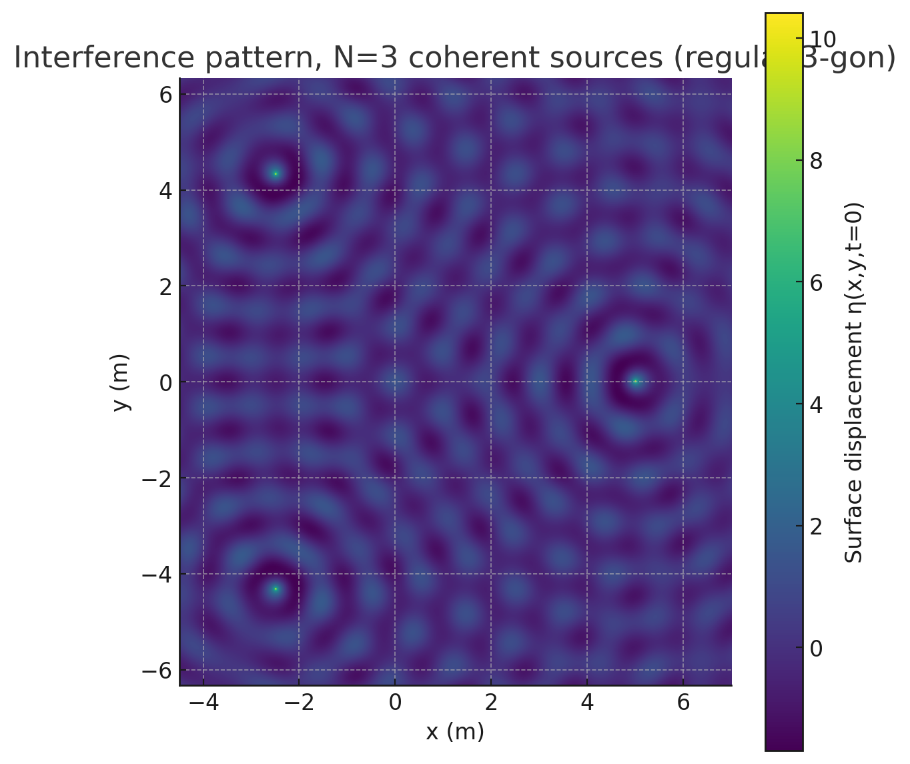

# Interference Patterns from Coherent Point Sources Arranged on a Regular Polygon

## Introduction  
When two or more waves overlap, they add **linearly**: peaks can reinforce, troughs can cancel, and rich interference patterns emerge.  
On a water surface, a single point disturbance radiates outward as circular ripples whose amplitude decays like $1/\sqrt{r}$.  
Placing *identical* (coherent) sources at the vertices of a regular polygon lets us explore how geometry dictates the symmetry of the resulting pattern.  
Such studies underpin technologies from loud-speaker arrays to radio antennas — and, in the laboratory, provide a visually striking demonstration of superposition.

---

## 1  Physical Model  

A source at $(x_i,y_i)$ generates  

$$
\eta_i(x,y,t)=\frac{A}{\sqrt{r_i}}\,
              \cos\!\bigl(k r_i-\omega t+\phi_i\bigr),\qquad
r_i=\sqrt{(x-x_i)^2+(y-y_i)^2}.
$$

* $A$ – common amplitude  
* $k=\tfrac{2\pi}{\lambda}$ – wave-number, $\lambda$ wavelength  
* $\omega=2\pi f$ – angular frequency  
* $r_i$ – distance from source *i* to field point $(x,y)$  
* $\phi_i$ – initial phase (here all set to zero)

Because water-surface displacements are small, linear superposition applies:

$$
\boxed{\,
  \eta_{\text{sum}}(x,y,t)=\sum_{i=1}^{N}\eta_i(x,y,t)
\,}
$$

---

## 2  Theory Highlights  

* **Constructive interference** — occurs where path-length differences satisfy  
  $|\,r_i-r_j\,| = m\lambda$ with $m\in\mathbb Z$.  
* **Destructive interference** — occurs where those differences equal  
  $(m+\tfrac12)\lambda$.

With more than two sources these conditions must be met *simultaneously* for every pair, producing a 2-D lattice of bright (antinodal) and dark (nodal) curves.  
The lattice inherits the same $N$-fold rotational symmetry as the source layout.

---

## 3  Numerical Experiment  

### 3.1  Parameters  
| Symbol | Value | Note |
|--------|-------|------|
| $A$ | 1 m | arbitrary scale |
| $\lambda$ | 1 m | sets spatial scale |
| $f$ | 1 Hz | time scale (snapshot at $t=0$) |
| $N$ | 3, 4, 5 | triangle, square, pentagon |
| $R$ | 5 m | circum-radius of the polygon |
| Grid | 600 × 600 | computational resolution |

### 3.2  Algorithm  
1. **Generate vertices** of a regular $N$-gon on a circle of radius $R$.  
2. **Build a square mesh** that encloses all sources.  
3. **Evaluate** $\eta_{\text{sum}}(x,y,0)$ on that mesh.  
4. **Plot** the field with `imshow`; add a colour-bar for magnitude and sign.  
5. **Repeat** for each $N$; save figures as PNG.

### 3.3  Python code  

```python
import numpy as np
import matplotlib.pyplot as plt

A, lam, f = 1.0, 1.0, 1.0
omega, k  = 2*np.pi*f, 2*np.pi/lam
polygon_sides = [3, 4, 5]
R, grid_pts, t = 5.0, 600, 0.0

def regular_vertices(N, R):
    ang = np.linspace(0, 2*np.pi, N, endpoint=False)
    return np.column_stack((R*np.cos(ang), R*np.sin(ang)))

def field(vertices):
    margin = 2.0
    x_min, x_max = vertices[:,0].min()-margin, vertices[:,0].max()+margin
    y_min, y_max = vertices[:,1].min()-margin, vertices[:,1].max()+margin
    x = np.linspace(x_min, x_max, grid_pts)
    y = np.linspace(y_min, y_max, grid_pts)
    X, Y = np.meshgrid(x, y)
    eta = np.zeros_like(X)
    for (x0, y0) in vertices:
        r = np.hypot(X-x0, Y-y0)
        r = np.where(r == 0, 1e-6, r)      # avoid division by zero
        eta += (A/np.sqrt(r))*np.cos(k*r - omega*t)
    return X, Y, eta

for N in polygon_sides:
    v = regular_vertices(N, R)
    X, Y, eta = field(v)
    plt.figure(figsize=(6, 6))
    plt.imshow(eta, extent=[X.min(), X.max(), Y.min(), Y.max()],
               origin='lower')
    plt.title(f'Interference pattern, N={N}')
    plt.xlabel('x (m)')
    plt.ylabel('y (m)')
    plt.colorbar(label='η(x,y,t=0)')
    plt.tight_layout()
    plt.savefig(f'pattern_N{N}.png', dpi=150)
    plt.close()
```





.png>)


.png>)


## 4&nbsp;Results & Discussion  

| $N$ | Qualitative features |
|-----|---------------------|
| **3** | Hexagon-like tiling of bright nodes; three-fold symmetry. |
| **4** | Checkerboard of nodal lines with a strong cross through the centre; four-fold symmetry. |
| **5** | Five-petal rosette; spiralling bright arms between vertices. |

As $N$ increases, the number of nodal intersections rises and the pattern becomes denser because each additional neighbour imposes another path-difference constraint.  
Symmetry breaking (for instance, by shifting one source’s phase) would visibly distort these lattices—an instructive exercise for further study.

---

## 5&nbsp;Extensions  

* **Time evolution** — animate $\eta_{\text{sum}}(x,y,t)$ over one period $T = 1/f$.  
* **Phase offsets** — assign non-zero $\phi_i$ to explore beam steering.  
* **Energy map** — plot time-averaged intensity $\langle \eta_{\text{sum}}^{2}\rangle$.  
* **3-D surface** — use `plot_surface` for a literal water-surface view.
