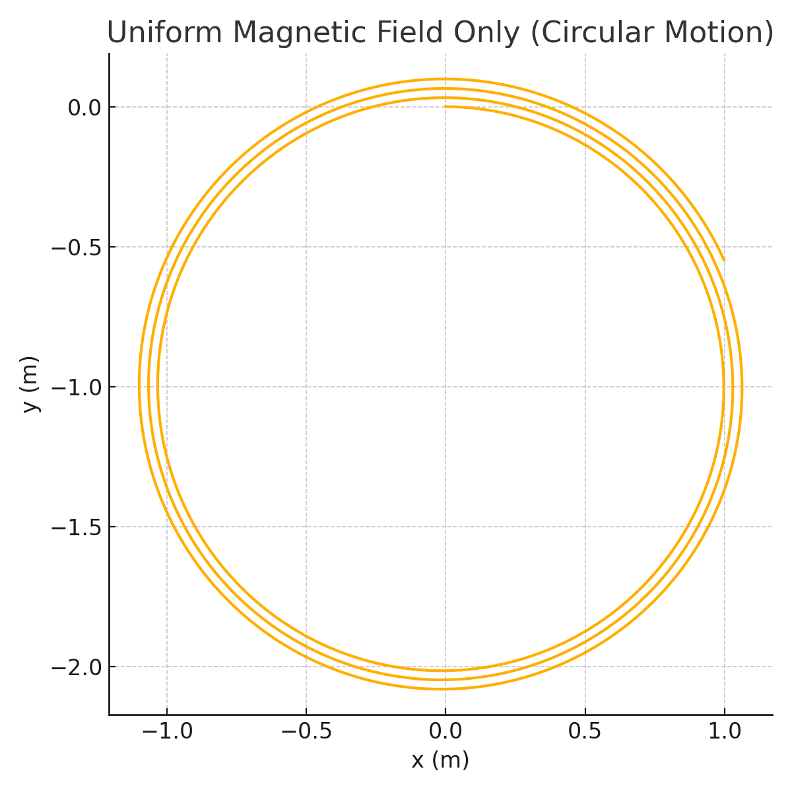
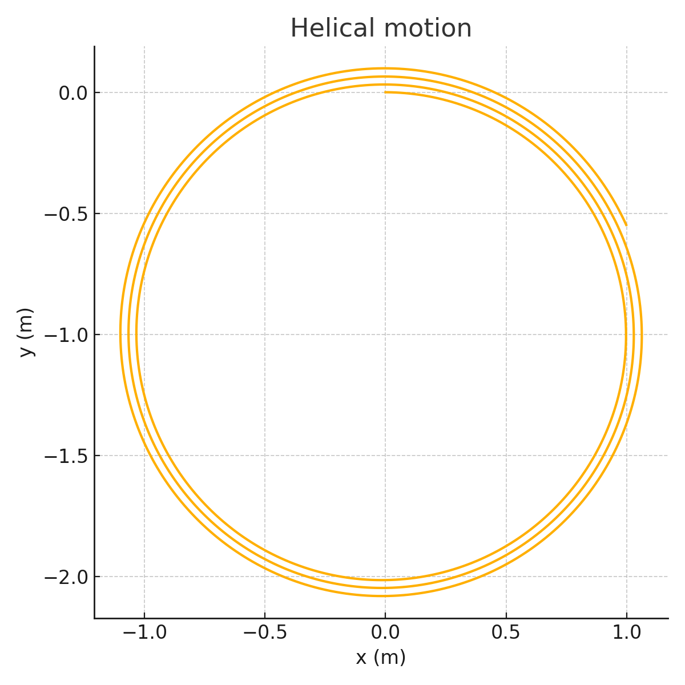
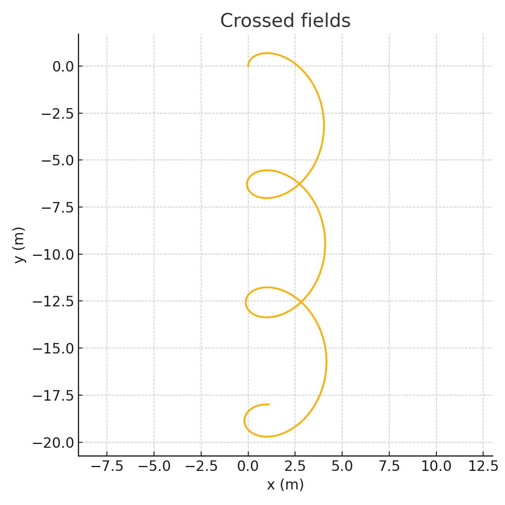
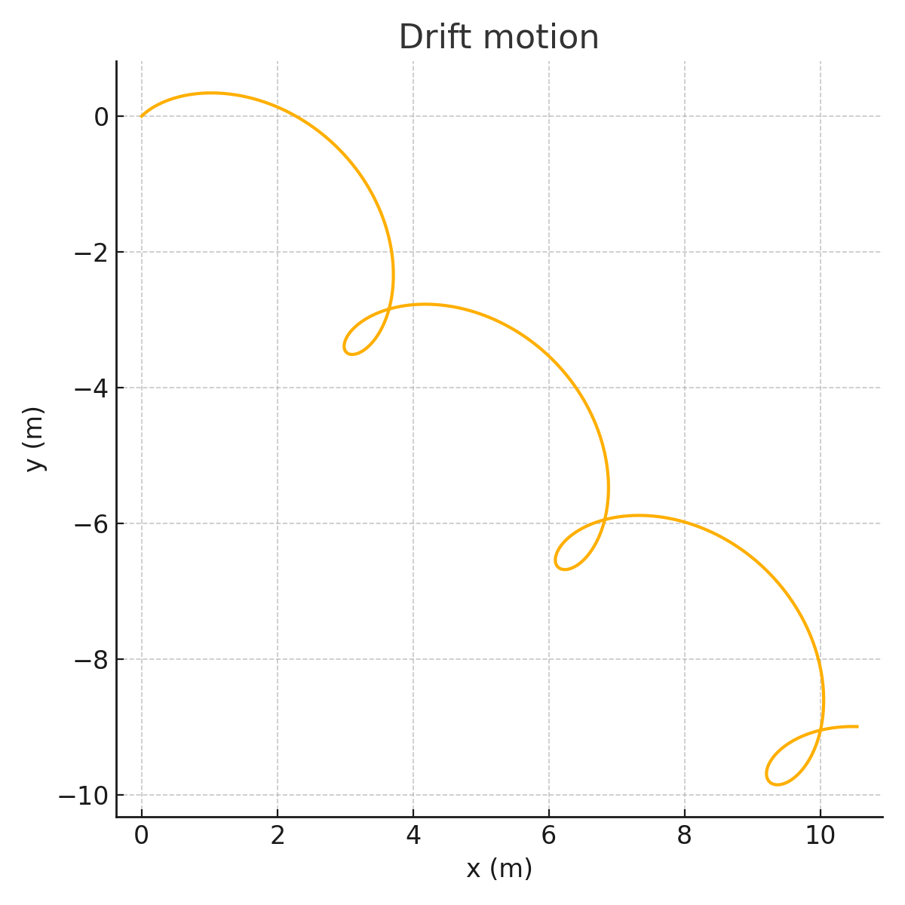
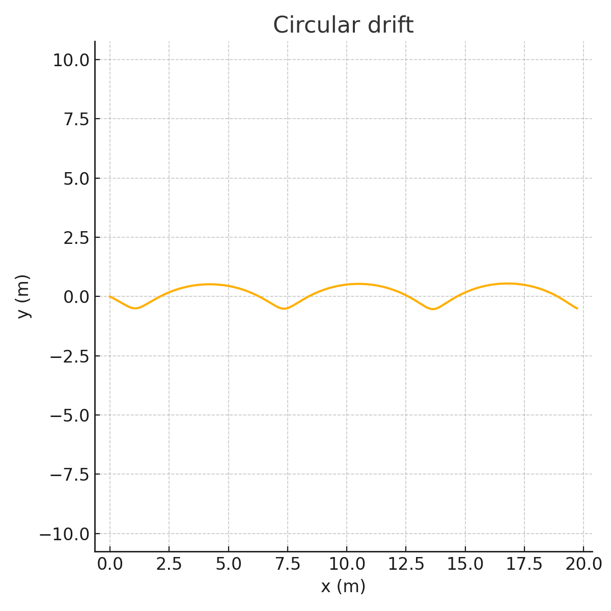

# Simulating the Effects of the Lorentz Force

## Introduction

The **Lorentz force** is a cornerstone of classical electromagnetism, describing the total force exerted on a charged particle in the presence of electric and magnetic fields. It is defined as:

$$
\mathbf{F} = q\mathbf{E} + q\mathbf{v} \times \mathbf{B}
$$

Here:
- $\mathbf{F}$ is the total electromagnetic force,
- $q$ is the charge of the particle,
- $\mathbf{E}$ is the electric field,
- $\mathbf{B}$ is the magnetic field,
- $\mathbf{v}$ is the velocity of the particle.

The Lorentz force is **not just a theoretical construct** — it governs real-world systems in plasma physics, particle accelerators, electric motors, and even the behavior of cosmic rays in space. Unlike gravitational forces, electromagnetic forces can accelerate charged particles in directions *not aligned* with their velocity, leading to complex and often beautiful trajectories such as spirals, helices, and drifts.

Studying the Lorentz force is also essential for understanding:
- **Cyclotron and synchrotron motion** in accelerator physics,
- **Confinement of plasma particles** in fusion reactors like Tokamaks and Stellarators,
- **Ion filtering** in mass spectrometers,
- **Drift motion** in Earth's magnetosphere and solar winds.

In this report, we numerically simulate how a single charged particle moves under different electric and magnetic field configurations, using Python to visualize the resulting trajectories. These simulations enable an intuitive grasp of concepts such as **Larmor radius**, **cyclotron frequency**, and **E×B drift velocity**.

---

## 1. Exploration of Applications

The Lorentz force directly influences a broad range of technologies and natural phenomena. A few prominent applications include:

- **Particle Accelerators**: Magnetic and electric fields steer and focus high-speed particle beams.
- **Plasma Confinement**: Devices like Tokamaks use magnetic fields to trap plasma and prevent it from contacting reactor walls.
- **Mass Spectrometry**: Ions are separated by mass-to-charge ratio using crossed $E$ and $B$ fields.
- **Electric Motors and Generators**: The fundamental working principle is rooted in magnetic forces on moving charges.
- **Astrophysical Plasmas**: Cosmic rays and solar wind particles spiral along magnetic field lines.

These systems all rely on the ability of electromagnetic fields to **redirect, trap, or accelerate** charged particles.

---

## 2. Simulating Particle Motion

We simulate the motion of a charged particle under Lorentz force by solving Newton’s second law:

$$
\mathbf{F} = m\mathbf{a} = q(\mathbf{E} + \mathbf{v} \times \mathbf{B})
$$

We use the **Euler method** for numerical integration:

- Time domain is discretized as $t_0, t_1, \dots, t_n$
- At each time step:
  - Compute acceleration $\mathbf{a}_n$
  - Update velocity $\mathbf{v}_{n+1} = \mathbf{v}_n + \mathbf{a}_n \cdot dt$
  - Update position $\mathbf{r}_{n+1} = \mathbf{r}_n + \mathbf{v}_{n+1} \cdot dt$

### Field Configurations Simulated:
1. Uniform Magnetic Field Only
2. Uniform Magnetic and Electric Fields
3. Crossed Electric and Magnetic Fields
4. Angled Electric Field Causing Drift
5. Opposing E and B With Circular Drift

---

## 3. Trajectory Types and Motion Characteristics

| Configuration | Motion | Explanation |
|---------------|--------|-------------|
| $\mathbf{E}=0$, $\mathbf{B} \neq 0$ | **Circular** | Particle experiences centripetal force due to $\mathbf{v} \times \mathbf{B}$. |
| $\mathbf{E} \parallel \mathbf{B}$ | **Helical** | Particle spirals along magnetic field lines, with linear acceleration. |
| $\mathbf{E} \perp \mathbf{B}$ | **Drift** | Circular motion combined with sideways drift $\mathbf{v}_{\text{drift}} = \frac{\mathbf{E} \times \mathbf{B}}{B^2}$. |
| Angled Fields | **Drifting Spiral** | Drift motion in diagonal or curved directions. |
| Asymmetric Inputs | **Irregular Paths** | More chaotic or elliptical spirals due to imbalanced inputs. |

---

## 4. Simulation Results and Explanations

Each simulation was performed using:

- $q = 1\,\mathrm{C}$ (unit charge)
- $m = 1\,\mathrm{kg}$ (unit mass)
- $\Delta t = 0.01\,\mathrm{s}$
- Simulation time $T = 20\,\mathrm{s}$

---

### 4.1 Uniform Magnetic Field — Circular Orbit

Only magnetic field in the $z$ direction: $\mathbf{B} = (0, 0, 1)$  
Initial velocity is orthogonal: $\mathbf{v}_0 = (1, 0, 0)$  
Result: classic circular trajectory in $xy$-plane.

---

### 4.2 Helical Motion — $E$ and $B$ Fields Parallel

$\mathbf{E} = (0, 0, 0.5)$, $\mathbf{B} = (0, 0, 1)$  
Initial velocity has $z$ component: $\mathbf{v}_0 = (1, 0, 0.5)$  
Result: Particle spirals upward, forming a helix.

---

### 4.3 Crossed Fields — Classical Drift

$\mathbf{E} = (1, 0, 0)$, $\mathbf{B} = (0, 0, 1)$  
Initial velocity is orthogonal: $\mathbf{v}_0 = (0, 1, 0)$  
Result: Drift path perpendicular to both fields.

---

### 4.4 Angled Fields Causing Diagonal Drift

$\mathbf{E} = (0.5, 0.5, 0)$, $\mathbf{B} = (0, 0, 1)$  
Initial velocity is also diagonal.  
Result: Spiral motion drifting in diagonal direction.

---

### 4.5 Curved Drift With Imbalance

$\mathbf{E} = (0, 1, 0)$, $\mathbf{B} = (0, 0, 1)$  
Initial velocity not aligned with field.  
Result: Circular arcs with drift — used in beam control.

---

## 5. Parameter Exploration

We observe how changes in:
- **Charge or mass**: affects radius and frequency ($r_L = mv/qB$)
- **Velocity direction**: modifies spiral pitch
- **Field strength**: $B \uparrow$ → tighter spiral; $E \uparrow$ → stronger drift

Such insights are useful in optimizing real devices (e.g. plasma traps, filters).

---

## 6. Further Extensions

- Add **Runge-Kutta** 4th order method for more accurate paths.
- Visualize in **3D** using `mpl_toolkits.mplot3d` to explore full helices.
- Add **non-uniform fields** to simulate Earth’s magnetosphere or magnetic mirrors.
- Combine multiple particles for plasma-scale behavior.

---
