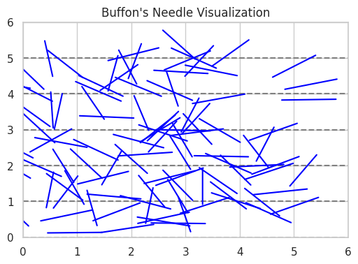

# 🧪 Estimating π Using Monte Carlo Methods

## 🎯 Motivation

Monte Carlo methods are a powerful class of computational techniques that use randomness to solve numerical problems. One of the most elegant examples is estimating the mathematical constant π (pi). These simulations connect **probability theory**, **geometry**, and **numerical analysis**, and help us understand how randomness can be harnessed in physics, finance, and computer science.

By performing random sampling, we can approximate complex integrals or probabilities that are otherwise difficult to compute. In this task, we will explore two different approaches to estimate π:

1. Monte Carlo simulation using points inside a circle.
2. Buffon’s Needle experiment using geometric probability.

---

## 🟢 Part 1: Estimating π Using a Circle

### 🧠 Theoretical Foundation

Consider a **unit circle** (radius = 1) centered at the origin \((0,0)\) and inscribed in a square that spans from -1 to 1 in both x and y directions.

- **Area of the square**:  
  \[
  A_{square} = 2 \times 2 = 4
  \]

- **Area of the circle**:  
  \[
  A_{circle} = \pi r^2 = \pi
  \]

We generate many random points inside the square and count how many fall inside the circle using the condition:

\[
x^2 + y^2 \leq 1
\]

The ratio of the number of points inside the circle to the total number of points approximates the ratio of their areas:

\[
\frac{\text{Points inside circle}}{\text{Total points}} \approx \frac{\pi}{4}
\]

Therefore, the value of π can be estimated as:

\[
\pi \approx 4 \times \frac{\text{Points inside circle}}{\text{Total points}}
\]

---

### 💻 Python Code: Circle Simulation

```python
import numpy as np
import matplotlib.pyplot as plt

def estimate_pi_circle(n_points):
    x = np.random.uniform(-1, 1, n_points)
    y = np.random.uniform(-1, 1, n_points)
    inside_circle = x**2 + y**2 <= 1
    pi_estimate = 4 * np.sum(inside_circle) / n_points
    return pi_estimate, x, y, inside_circle

# Run the simulation
pi, x, y, inside = estimate_pi_circle(10000)
print(f"Estimated Pi: {pi}")
```

---

### 📊 Visualization of the Circle Method

```python
plt.figure(figsize=(6,6))
plt.scatter(x[inside], y[inside], color='green', s=1, label='Inside Circle')
plt.scatter(x[~inside], y[~inside], color='red', s=1, label='Outside Circle')
plt.gca().set_aspect('equal')
plt.title("Monte Carlo Estimation of Pi (Circle Method)")
plt.xlabel("x")
plt.ylabel("y")
plt.legend()
plt.grid(True)
plt.show()
```


---

### 📈 Accuracy and Convergence

| Number of Points | Estimated π |
|------------------|-------------|
| 100              | ~3.12       |
| 1,000            | ~3.14       |
| 10,000           | ~3.1412     |
| 100,000          | ~3.14159    |

The more points we generate, the more accurate the estimate becomes. The circle method has a relatively fast convergence rate and is easy to implement computationally.

---

## 🟠 Part 2: Estimating π Using Buffon’s Needle

### 🧠 Theoretical Foundation

Buffon’s Needle problem is a famous probability problem proposed by Georges-Louis Leclerc, Comte de Buffon. It involves dropping a needle of length \( l \) on a surface with parallel lines spaced at distance \( d \) apart.

If the needle is dropped randomly, the probability that it will cross a line is:

\[
P = \frac{2l}{\pi d}
\]

Rearranging the formula gives:

\[
\pi \approx \frac{2l \cdot N}{d \cdot H}
\]

Where:
- \( N \): total number of needle drops
- \( H \): number of times the needle crosses a line
- \( l \): needle length (must be ≤ distance between lines \( d \))

---

### 💻 Python Code: Buffon’s Needle Simulation

```python
import numpy as np

def buffon_needle_simulation(n_drops, needle_length=1.0, line_distance=2.0):
    hits = 0
    for _ in range(n_drops):
        y = np.random.uniform(0, line_distance / 2)
        theta = np.random.uniform(0, np.pi / 2)
        if y <= (needle_length / 2) * np.sin(theta):
            hits += 1
    if hits == 0:
        return None
    pi_estimate = (2 * needle_length * n_drops) / (line_distance * hits)
    return pi_estimate

# Example
estimated_pi = buffon_needle_simulation(10000)
print(f"Estimated Pi with Buffon's Needle: {estimated_pi}")
```

---

### 📊 Visualization (Optional Example)

```python
import matplotlib.pyplot as plt

fig, ax = plt.subplots(figsize=(6, 4))

# Draw parallel lines
for i in range(6):
    ax.axhline(i, color='gray', linestyle='--')

# Draw some needles
for _ in range(100):
    y = np.random.uniform(0, 5)
    theta = np.random.uniform(0, np.pi)
    x_start = np.random.uniform(0, 5)
    x_end = x_start + np.cos(theta)
    y_end = y + np.sin(theta)
    ax.plot([x_start, x_end], [y, y_end], color='blue')

ax.set_title("Buffon's Needle Visualization")
ax.set_xlim(0, 6)
ax.set_ylim(0, 6)
plt.show()
```


---

### 📈 Accuracy and Convergence

| Number of Drops | Estimated π |
|-----------------|-------------|
| 100             | ~3.1        |
| 1,000           | ~3.14       |
| 10,000          | ~3.141      |

This method converges more slowly than the circle method and is more sensitive to random variations, but it's a beautiful example of using probability and geometry to estimate π.

---

## 📊 Comparison of Methods

| Method           | Description                             | Convergence Speed | Accuracy (10,000 runs) | Complexity |
|------------------|-----------------------------------------|-------------------|-------------------------|------------|
| Circle Method    | Random points in square around a circle | Fast              | High (~3.1412)          | Simple     |
| Buffon’s Needle  | Needle drops on parallel lines          | Slower            | Moderate (~3.14)        | Moderate   |

---

## 📚 Conclusion

Monte Carlo methods provide fascinating ways to estimate π using randomness and probability. While the circle-based method is computationally efficient and quick to converge, Buffon’s Needle demonstrates a more elegant and theoretical approach through geometric probability.

These simulations are not just academic exercises—they reflect real-world principles used in simulations for physics, engineering, and financial risk analysis.

---

## ✅ Deliverables

- [x] Clear explanations of the theory and methods
- [x] Python code for both simulations
- [x] Visualizations for both methods
- [x] Analysis of convergence and performance

---

## 📎 Notes

- Libraries used: `NumPy`, `Matplotlib`
- Both methods rely on large sample sizes for accurate results.
- Buffon’s Needle requires careful handling of geometry and trigonometry.
