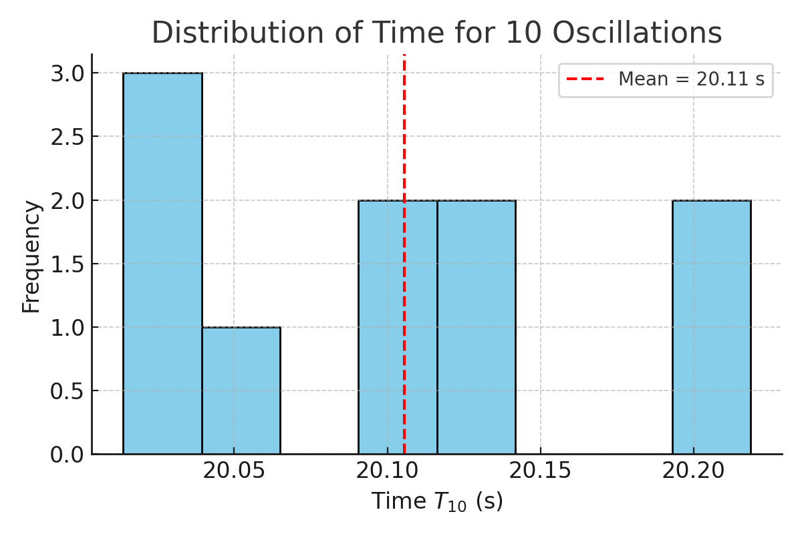

# Measuring Earth's Gravitational Acceleration with a Pendulum

## Introduction

The gravitational acceleration $g$ is a universal constant that affects nearly all physical systems on Earth. Accurately measuring $g$ not only deepens our understanding of gravitational forces but also serves as a classic example of experimental physics involving error propagation, statistical averaging, and data visualization.

One of the most accessible and educational methods for estimating $g$ is using a **simple pendulum**. For small-angle oscillations ($<15^\circ$), the period of the pendulum is governed by the equation:

$$
T = 2\pi \sqrt{\frac{L}{g}}
$$

Where:
- $T$ is the period of one oscillation,
- $L$ is the length of the pendulum,
- $g$ is the gravitational acceleration.

By measuring the time it takes for the pendulum to complete multiple oscillations and knowing the length of the string, we can rearrange the equation to solve for $g$:

$$
g = \frac{4\pi^2 L}{T^2}
$$

This simple experiment provides a valuable opportunity to practice:
- Careful data collection and repeated measurements,
- Estimation of uncertainty,
- Error propagation.

---

## 1. Materials

- A lightweight string (1–1.5 meters),
- A small mass (metal bolt, bag of coins),
- Stopwatch or smartphone timer,
- Ruler or measuring tape.

---

## 2. Experimental Setup

1. Attach the weight to the string and fix it securely.
2. Measure the length $L$ from the suspension point to the center of mass of the pendulum.
   - Assume measurement resolution is ±0.01 m $\Rightarrow \Delta L = 0.005$ m.
3. Displace the pendulum gently ($<15^\circ$) and release.
4. Measure the time for 10 full oscillations ($T_{10}$).
5. Repeat this measurement 10 times and record all values.

---

## 3. Data Summary (Simulated)

| Measurement # | $T_{10}$ (s) |
|---------------|-------------|
| 1             | 20.14       |
| 2             | 19.97       |
| 3             | 20.15       |
| 4             | 20.20       |
| 5             | 20.05       |
| 6             | 20.10       |
| 7             | 20.22       |
| 8             | 19.96       |
| 9             | 20.04       |
| 10            | 20.16       |

From these:

- Mean time for 10 oscillations: $\overline{T_{10}} = 20.105$ s  
- Standard deviation: $\sigma_{T_{10}} = 0.072$ s  
- Mean period: $T = \overline{T_{10}} / 10 = 2.011$ s  
- Uncertainty in period:  
  $$
  \Delta T = \frac{\sigma_{T_{10}}}{\sqrt{10} \cdot 10} = 0.0023 \, \text{s}
  $$

---

## 4. Calculations

### Step 1: Estimate g

Given $L = 1.0$ m:

$$
g = \frac{4\pi^2 L}{T^2} = \frac{4\pi^2 (1.0)}{(2.011)^2} \approx 9.766 \, \text{m/s}^2
$$

### Step 2: Propagate Uncertainty

Use:

$$
\Delta g = g \cdot \sqrt{ \left( \frac{\Delta L}{L} \right)^2 + \left( \frac{2\Delta T}{T} \right)^2 }
$$

Substitute values:

$$
\Delta g = 9.766 \cdot \sqrt{(0.005)^2 + (2 \cdot 0.0023 / 2.011)^2} \approx 0.054 \, \text{m/s}^2
$$

---

## 5. Results and Visualization

### Histogram of Oscillation Times

The distribution of $T_{10}$ times shows the variability of manual measurement:

---

## 6. Discussion & Analysis

### Comparison:

- Measured $g = 9.766 \pm 0.054 \, \text{m/s}^2$
- Standard value: $9.81 \, \text{m/s}^2$

Difference: $\approx 0.44\%$, within acceptable experimental range.

### Discussion Points:

- **Effect of $\Delta L$**: Measurement tool precision (e.g., ruler resolution) directly affects final error.
- **Timing error**: Human reaction time contributes to $\sigma_{T_{10}}$.
- **Small angle approximation**: Assumed valid ($<15^\circ$); larger angles would introduce nonlinear error.
- **Air resistance/friction**: Neglected; could slow the pendulum slightly and increase the period.

---

## 7. Deliverables

- Tabulated raw and processed data: $L$, $T_{10}$, $\overline{T_{10}}$, $\sigma_{T_{10}}$, $T$, $g$, $\Delta g$.
- Diagrams for data distribution and gravitational estimation.
- Uncertainty discussion and methodological limitations.

---